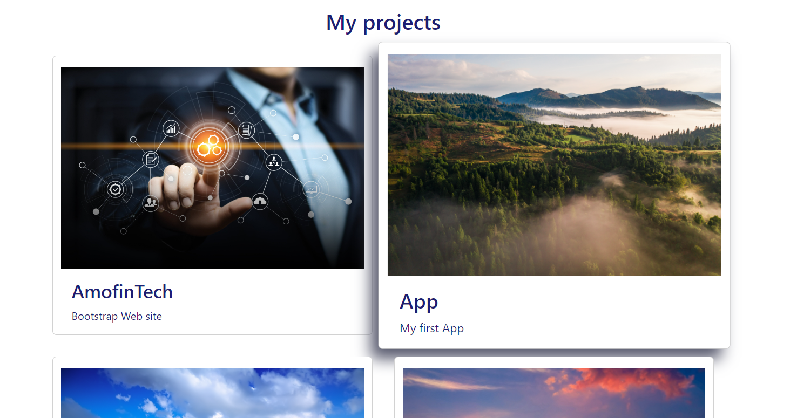
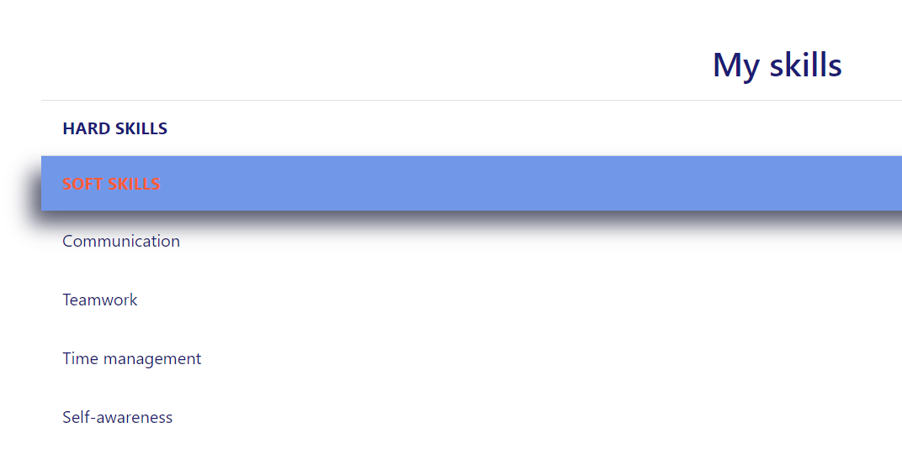

# Bootstrap-Portfolio

My Bootstrap Portfolio

## Description

In this portfolio, I would like to show my skills

## Installation

N/A

## Usage

In this project, I use the skills of HTML, CSS and Bootstrap to demonstrate my real projects that will complement this portfolio in the future.

There are a few new elements that were created using the Bootstrap:

- hover button
  

- stylized cards
  

- accordion-buttons
  

Updates will be available in the repository at the link:
https://github.com/Smileshum07/Bootstrap-Portfolio

## Credits

N/A

## License

Please refer to the LICENSE in the repo
